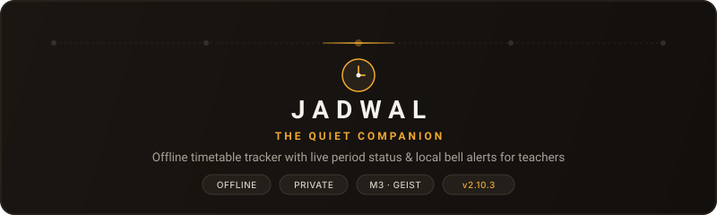

<div align="center">

<picture>
  <source media="(prefers-color-scheme: dark)" srcset=".github/assets/banner-dark.svg">
  <source media="(prefers-color-scheme: light)" srcset=".github/assets/banner-light.svg">
  
</picture>

**An offline, glanceable timetable companion for teachers.**

[](https://github.com/Dariokisumo/Jadwal/releases/latest)
[](LICENSE)
[](https://github.com/Dariokisumo/Jadwal/releases)
[](#privacy--permission-transparency)
[](https://flutter.dev)

[Download APK](#download--installation) &ensp;·&ensp; [The Quiet Companion](#the-quiet-companion) &ensp;·&ensp; [How It Works](#how-it-works) &ensp;·&ensp; [Architecture & Design](#architecture--design-system) &ensp;·&ensp; [Development](#development)

</div>

---

## Download & Installation

Pre-compiled, signed APK binaries are published with every release. Jadwal requires zero setup after installing.

| Binary | Target Architecture | Devices | Size | SHA-256 |
|:---|:---|:---|---:|:---|
| [`jadwal-v2.10.3-62-release.apk`](https://github.com/Dariokisumo/Jadwal/releases/download/v2.10.3/jadwal-v2.10.3-62-release.apk) | **arm64-v8a** (64-bit) | Modern Android phones & tablets *(Recommended)* | ~24.2 MB | `a857cc...fd9f` |
| [`jadwal-v2.10.3-62-arm32-release.apk`](https://github.com/Dariokisumo/Jadwal/releases/download/v2.10.3/jadwal-v2.10.3-62-arm32-release.apk) | **armeabi-v7a** (32-bit) | Budget & legacy school hardware | ~21.8 MB | `ac234f...c680` |

> [!TIP]
> Download the **arm64-v8a** version for virtually all devices manufactured after 2017. Verify complete release notes and checksums on the [Releases page](https://github.com/Dariokisumo/Jadwal/releases/latest).

---

## The Quiet Companion

Teachers should not have to decode a dense, laminated paper timetable between bells. Jadwal sits quietly in a teacher's pocket and does one thing with absolute precision: **tell them what is happening now, what comes next, and when it is time to move.**

```text
 08:00 AM                        09:30 AM                       03:30 PM
 ┌──────────────┬────────────────────────────────┬──────────────┐
 │   COMPLETED  │             ACTIVE             │   UPCOMING   │
 │   Period 1   │   Period 2 · Room 14B · Math   │   Period 3   │
 └──────────────┴────────────────────────────────┴──────────────┘
                     ▲
                     └── Live countdown & local bell alert
```

### Five Core Principles

1. **One Glance Is Enough**  
   The current period, room number, subject, and time remaining are immediately visible without tapping, scrolling, or navigating submenus.
2. **100% Offline & Private by Design**  
   No user accounts, no login screens, no cloud databases, and zero network calls. Timetable data remains exclusively on the device storage.
3. **Earned Trust Through Reliability**  
   Local alarms and notifications fire accurately at period boundaries without draining battery life. A home-screen widget keeps the schedule accessible at all times.
4. **Minimal Cognitive Load Setup**  
   Two-step setup: copy the in-app extraction prompt, hand a paper timetable photo to an AI model (Gemini, Claude, or ChatGPT), and import the returned JSON file.
5. **Respect for the School Rhythm**  
   The interface naturally differentiates teaching periods, break intervals, free periods, and weekend states without visual noise.

---

## How It Works

Jadwal eliminates tedious manual data entry by delegating schedule extraction to vision AI models via a strict schema prompt:

```text
┌───────────────────────┐       ┌────────────────────────┐       ┌───────────────────────┐
│  Paper Timetable Photo │ ───>  │ Vision AI + App Prompt │ ───>  │  Timetable JSON File  │
└───────────────────────┘       └────────────────────────┘       └───────────────────────┘
                                                                             │
                                                                    One-Tap Import
                                                                             ▼
                                                                 ┌───────────────────────┐
                                                                 │  Live Schedule & Bell │
                                                                 │    Alarms Scheduled   │
                                                                 └───────────────────────┘
```

1. **Copy the Prompt**: Open Jadwal and tap **Copy Prompt** on the setup screen.
2. **Process Photo**: Attach a photo of the school paper timetable to your preferred AI tool along with the prompt.
3. **Import File**: Tap **Upload JSON File** (or try the built-in **Demo Schedule**) to load the timetable.
4. **Active Tracking**: Jadwal verifies schedule integrity, populates the weekly grid, and schedules local notifications for upcoming periods.

<details>
<summary><b>Inspect Schema & Sample JSON Structure</b></summary>
<br>

```json
{
  "school": "St. Jude Academy",
  "academicYear": "2026",
  "schedule": {
    "Monday": [
      {
        "period": "1",
        "startTime": "8:00 AM",
        "endTime": "8:45 AM",
        "subject": "Mathematics",
        "grade": "Grade 10A",
        "room": "Room 104"
      },
      {
        "period": "Break",
        "startTime": "8:45 AM",
        "endTime": "9:00 AM",
        "subject": "Morning Break",
        "grade": "",
        "room": ""
      }
    ]
  }
}
```

</details>

---

## Architecture & Design System

Jadwal is built with a **Semantic-Relational** design architecture derived from content meaning and physical context:

```text
lib/
├── constants/       # Schedule prompt, timetable schema & interval tokens
├── models/          # Period data model & live chronological state machine
├── screens/         # Setup, manual schedule editor & daily dashboard
├── services/        # Offline storage, JSON validator & local notification engine
├── theme/           # OKLCH two-tier token system & Material 3 integration
└── widgets/         # Glanceable timetable cards, time rulers & header pills
```

### Visual Engineering Highlights

- **Perceptual OKLCH Token System**: Color logic is separated into Tier-1 primitives (`lib/theme/primitives.dart`) and Tier-2 semantic aliases (`lib/theme/relational_colors.dart`), exposed via `context.relColors`.
- **Five Scholarly Accents**: Users can select between five curated accent seeds:
  - **Gold** (`#D4930D` / `#F0A830`): Warm saffron, scholarly baseline.
  - **Navy** (`#1E3A5F` / `#5A89C7`): Crisp, formal contrast.
  - **Copper** (`#C77D38` / `#E29A57`): Warm, earthy twilight harmony.
  - **Sage** (`#4A6B53` / `#7CA886`): Calming, low-fatigue natural green.
  - **Slate** (`#4B5563` / `#9CA3AF`): Monochromatic editorial simplicity.
- **Warm Neutral Surfaces**: Avoids stark black or sterile white; uses warm paper neutrals (`#FFFCF5` in Light mode, `#1A1612` in Dark mode).
- **Native Android Glance Widget**: Native home-screen widget implemented in Kotlin using Jetpack Glance (`JadwalGlanceWidget.kt`), updating live period progress without launching the Flutter engine.
- **Geist Typography**: Geometric sans-serif font pairing optimized for high-density chronological readouts.

---

## Development

### Prerequisites

- Flutter SDK `3.44.x` (or newer stable)
- Dart SDK `3.12.x`
- Java Development Kit (JDK 17 recommended for AGP 8.7 stability)
- Android SDK Platform Tools (API 34+)

### Quickstart

Clone the repository and install dependencies:

```bash
git clone https://github.com/Dariokisumo/Jadwal.git
cd Jadwal
flutter pub get
```

Launch on an attached Android device or emulator:

```bash
flutter run
```

### Build Automation

The project includes pre-configured automation scripts and a `Makefile` for zero-configuration release builds:

```bash
# Build 64-bit release APK (arm64-v8a)
make build

# Build 32-bit release APK (armeabi-v7a)
make build-arm32

# Build both architectures concurrently
make build-both

# Verify Android build environment and SDK paths
make verify-env
```

---

## Privacy & Permission Transparency

Jadwal operates under a strict privacy-first model:

| Permission | Purpose | System Behavior |
|:---|:---|:---|
| `POST_NOTIFICATIONS` | Period start alerts | Prompted only once on first run; can be silenced at any time. |
| `SCHEDULE_EXACT_ALARM` | Precise bell timing | Required for time-critical alerts before classes begin. |
| Native Photo Picker | Selecting timetable images | Uses Android Photo Picker (API 33+); zero storage permissions required. |
| **Network Access** | **None** | The application does not declare `android.permission.INTERNET`. |

> [!NOTE]
> Because Jadwal contains zero network permissions, your timetable, schedule data, and school routines can never leave your device.

---

## License

Jadwal is free and open-source software licensed under the **GNU General Public License v3.0**. See the [LICENSE](LICENSE) file for terms and conditions.

---

<div align="center">
<sub>Crafted with quiet restraint for educators everywhere.</sub>
</div>
